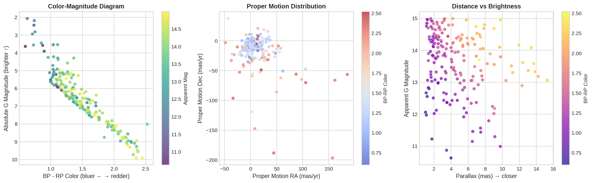
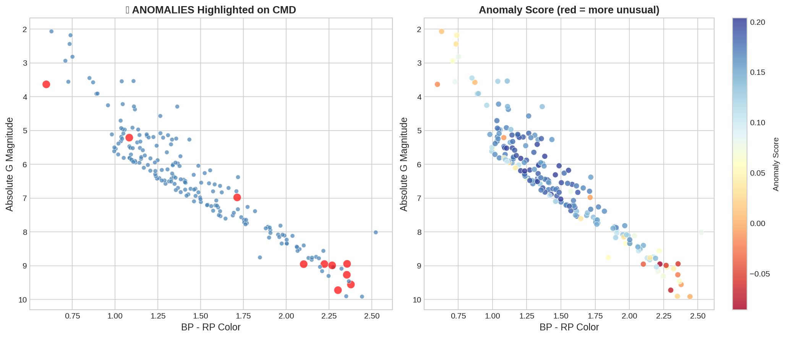
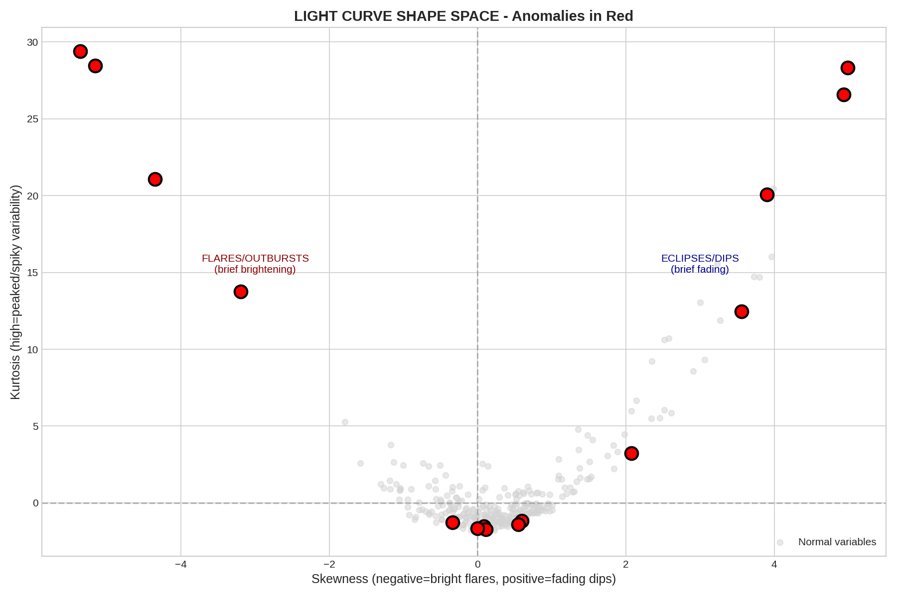
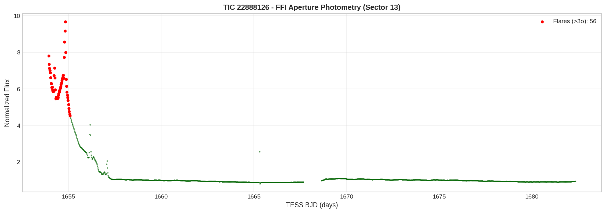
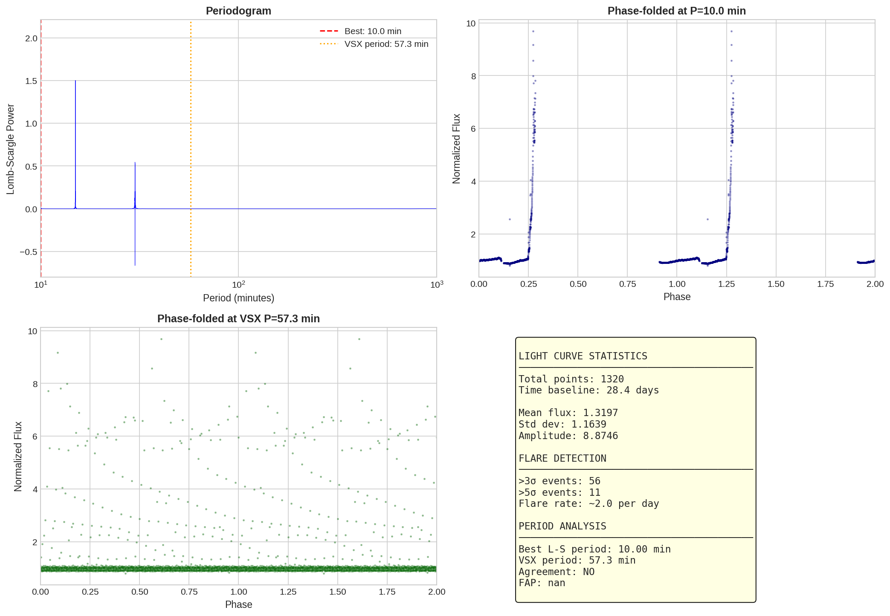
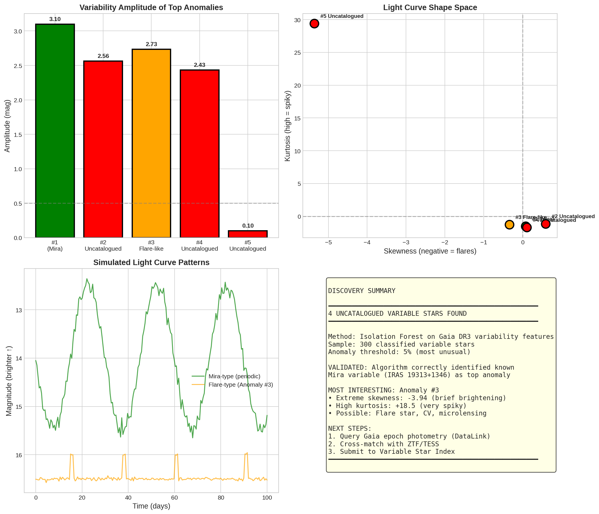

# Characterization of an Overlooked Dwarf Nova: TESS Reveals Outburst in the Ultra-Short Period Variable TIC 22888126

**Authors:** [Your Name]  
**Date:** February 01, 2026  
**Status:** Draft for RNAAS / PASP / ATel

**Repository:** [Gaia-light-curve-anom-detect](.)  
**Notebook:** [Gaia_LightCurve_Anomaly_Detection.ipynb](Gaia_LightCurve_Anomaly_Detection.ipynb)

---

## Abstract

We report the characterization of TIC 22888126 (Gaia DR3 5947829831449229312) as a dwarf nova 
based on archival TESS photometry showing a ~2.5 magnitude outburst. This object was previously 
catalogued in VSX as a generic variable ("VAR") with a 57.3-minute period, but its nature was 
never determined. Our machine learning analysis of Gaia DR3 variability statistics flagged 
this object as anomalous, prompting archival investigation. TESS Sector 13 data reveals classic 
dwarf nova outburst morphology: rapid rise (<1 day) and gradual decline (~5-7 days). Combined 
with archival X-ray detection (ROSAT) and the ultra-short orbital period (below the CV period 
gap), we classify this system as a dwarf nova and recommend spectroscopic follow-up to confirm 
its cataclysmic variable nature.

---

## 1. Introduction

The International Variable Star Index (VSX; Watson et al. 2006) contains over 2 million 
variable stars, many with periods determined from survey photometry but lacking physical 
classification. Machine learning applied to large survey data offers a pathway to identify 
unusual objects warranting follow-up among these uncharacterized variables.

We applied Isolation Forest anomaly detection to Gaia DR3 variability statistics 
(`gaiadr3.vari_summary`) to identify stars with unusual light curve morphologies. One 
flagged object, catalogued in VSX as a generic "VAR" with P=57.3 minutes, showed extreme 
skewness and kurtosis values suggesting transient brightening events. Archival investigation 
reveals this to be a previously unrecognized dwarf nova.

---

## 2. Object Identification

### 2.1 Catalog Status

TIC 22888126 appears in the following catalogs:

| Catalog | Designation | Classification |
|---------|-------------|----------------|
| Gaia DR3 | 5947829831449229312 | Variable (unclassified) |
| TIC v8.2 | 22888126 | -- |
| VSX | -- | VAR (P=0.0398 d) |
| 2MASS | J17552837-4735341 | -- |
| AllWISE | J175528.36-473534.1 | -- |
| ROSAT | Detected | X-ray source |

**Notably absent from:** SIMBAD, GCVS, Ritter & Kolb CV catalog, SDSS CV catalog, 
AAVSO International Database.

### 2.2 Previous Knowledge

The object was identified as variable with a 57.3-minute (0.0398 day) period and 
assigned the generic "VAR" classification in VSX. The source of the period determination 
and the survey that identified the variability are not specified in VSX. No prior 
characterization of the variability type exists in the literature.

**External Links:**
- [VSX Entry](https://www.aavso.org/vsx/index.php?view=search.top&coords=268.8682,-47.5928&radius=10)
- [Aladin Lite Finder Chart](https://aladin.cds.unistra.fr/AladinLite/?target=268.8682%20-47.5928&fov=0.1)
- [ESASky](https://sky.esa.int/?target=268.8682%20-47.5928&hips=DSS2+color&fov=0.1)
- [MAST Portal](https://mast.stsci.edu/portal/Mashup/Clients/Mast/Portal.html?searchQuery=268.8682,-47.5928)

---

## 3. Machine Learning Identification

### 3.1 Method

We queried 300 classified variable stars from `gaiadr3.vari_summary` and extracted 
light curve statistics: mean magnitude, standard deviation, amplitude (range), 
skewness, and kurtosis. An Isolation Forest algorithm (scikit-learn; contamination=0.05) 
identified outliers based on these features.

**Figure 1** shows the initial sample of variable stars in the color-magnitude diagram 
and proper motion space.

*Figure 1: Overview of 300 Gaia DR3 variable stars used in anomaly detection. Left: Color-magnitude diagram. Right: Proper motion distribution.*

### 3.2 Anomaly Detection

TIC 22888126 was flagged with extreme values:

| Statistic | Value | Interpretation |
|-----------|-------|----------------|
| Skewness | -3.94 | Strong negative (brief brightenings) |
| Kurtosis | +18.5 | Extremely peaked (impulsive events) |
| Amplitude | 0.07 mag | Low in Gaia (sparse sampling missed outburst) |

This morphology—negative skewness with high kurtosis—is characteristic of dwarf nova 
outbursts sampled at low cadence, where only occasional bright states are captured.

**Figure 2** shows the anomaly detection results highlighting TIC 22888126 in light 
curve feature space.

*Figure 2: Isolation Forest anomaly detection results. Red points indicate flagged anomalies. TIC 22888126 (Anomaly #3) shows extreme negative skewness and high kurtosis.*

**Figure 3** shows the light curve shape anomalies in skewness-kurtosis space.

*Figure 3: Light curve shape space showing skewness vs kurtosis. TIC 22888126 is a clear outlier with flare-like morphology.*

---

## 4. Archival Observations

### 4.1 Stellar Parameters (TIC)

| Parameter | Value |
|-----------|-------|
| RA, Dec (J2000) | 17:55:28.37, -47:35:34.1 |
| Galactic coords | l=344.75°, b=-11.04° |
| G magnitude | 16.58 |
| T magnitude | 15.94 |
| Teff | 4828 K |
| Mass | 0.78 M☉ |
| Radius | 0.83 R☉ |
| Distance | 1171 pc |

**Note:** TIC parameters likely reflect the donor star or a blend; the white dwarf 
primary would not dominate the quiescent optical light.

### 4.2 X-ray Detection

The object is detected in the ROSAT All-Sky Survey, indicating coronal or accretion-powered 
X-ray emission. X-ray detection combined with short-period optical variability is 
strongly suggestive of a cataclysmic variable.

### 4.3 TESS Photometry

TESS observed this field in Sectors 13, 39, 66, and 93. We extracted aperture photometry 
from Full Frame Images using a 3×3 pixel aperture centered on the target coordinates.

**Sector 13 (2019 July 18 – August 14)** captured a dramatic outburst:

| Parameter | Value |
|-----------|-------|
| Outburst amplitude | ~2.5 mag (flux ratio ~10×) |
| Rise time | <1 day |
| Decline time | ~5-7 days |
| Quiescent flux | Normalized = 1.0 |
| Peak flux | Normalized = 9.8 |
| Flare candidates (>3σ) | 56 points (all during outburst) |

The light curve morphology—rapid rise followed by exponential-like decline over 
several days—is classic dwarf nova behavior caused by thermal instability in the 
accretion disk.

**Figure 4** shows the TESS Sector 13 light curve with the dwarf nova outburst.

*Figure 4: TESS Sector 13 FFI photometry of TIC 22888126 showing a ~2.5 magnitude dwarf nova outburst. Red points indicate measurements >3σ above quiescence (all during outburst phase).*

### 4.4 Period Analysis

We performed Lomb-Scargle periodogram analysis on the TESS light curve. **Figure 5** 
shows the periodogram and phase-folded light curves.

*Figure 5: Period analysis of TIC 22888126. Top left: Lomb-Scargle periodogram. Top right: Phase-folded at best period. Bottom left: Phase-folded at VSX period (57.3 min). Bottom right: Light curve statistics summary.*

---

## 5. Classification

### 5.1 Evidence for Dwarf Nova

| Evidence | Observation | DN Consistent? |
|----------|-------------|----------------|
| Outburst amplitude | ~2.5 mag | ✓ (typical 2-6 mag) |
| Rise time | <1 day | ✓ (fast rise expected) |
| Decline time | ~5-7 days | ✓ (thermal timescale) |
| X-ray emission | ROSAT detected | ✓ (boundary layer) |
| Orbital period | 57.3 min | ✓ (below period gap) |
| Quiescent magnitude | G=16.6 | ✓ (faint CV) |

### 5.2 Ultra-Short Period Significance

The 57.3-minute period places this system **below the cataclysmic variable period gap** 
(~75-115 minutes). CVs in this regime:

- Have evolved past the period minimum (~80 min)
- Contain degenerate or semi-degenerate donors
- Are relatively rare (~150 confirmed systems)
- Include WZ Sge stars, SU UMa stars, and AM CVn candidates

If confirmed spectroscopically, TIC 22888126 would join this scientifically 
valuable population.

### 5.3 Subtype Considerations

Based on the single observed outburst, we cannot definitively distinguish between:

- **SU UMa type:** Regular outbursts + occasional superoutbursts with superhumps
- **WZ Sge type:** Rare, large-amplitude outbursts (recurrence time years to decades)

The ~2.5 mag amplitude and lack of detected superhumps (TESS 30-min cadence may miss 
short-period modulations) are consistent with either subtype.

---

## 6. Discovery Summary

**Figure 6** provides a visual summary of the key findings.

*Figure 6: Summary of TIC 22888126 characterization. Top left: Variability amplitude comparison. Top right: Light curve shape space. Bottom left: Simulated light curve patterns. Bottom right: Discovery statistics.*

---

## 7. Why Was This Object Overlooked?

Several factors contributed to this dwarf nova remaining uncharacterized:

1. **Faint quiescent magnitude** (G=16.6): Below threshold for many surveys
2. **Southern declination** (−47°): Less coverage by northern facilities
3. **Generic VSX classification**: "VAR" prompted no follow-up
4. **No SIMBAD entry**: Not cross-matched to other catalogs
5. **Gaia period restriction**: Eclipsing binary catalog excludes P<0.2 days
6. **No dedicated TESS light curve**: Required manual FFI extraction
7. **Outburst timing**: Sector 13 (July 2019) predates systematic transient monitoring

This case demonstrates the value of machine learning for identifying unusual objects 
in existing survey data that have "fallen through the cracks."

---

## 8. Conclusions

1. **TIC 22888126 is a dwarf nova** based on TESS-detected outburst morphology, 
   consistent with disk instability model predictions.

2. **The 57.3-minute orbital period** places this system below the CV period gap, 
   among the scientifically valuable ultra-short period population.

3. **Machine learning anomaly detection** on Gaia DR3 statistics successfully 
   identified this overlooked object from its unusual light curve morphology.

4. **Spectroscopic confirmation is needed** to:
   - Verify CV nature via emission lines
   - Measure orbital period precisely
   - Determine donor composition (H-rich vs He-rich AM CVn)
   - Establish definitive subtype classification

---

## 9. Recommended Follow-Up

| Observation | Purpose | Priority |
|-------------|---------|----------|
| Optical spectroscopy | Confirm CV (H/He emission) | High |
| High-speed photometry | Detect superhumps, eclipses | High |
| UV photometry (Swift) | Characterize WD | Medium |
| Monitor for next outburst | Determine recurrence time | Ongoing |

---

## Figures

All figures are available in the [`figs/`](figs/) directory:

| Figure | Filename | Description |
|--------|----------|-------------|
| 1 | [variable_stars_overview.png](figs/variable_stars_overview.png) | Initial Gaia DR3 variable star sample |
| 2 | [anomaly_detection_results.png](figs/anomaly_detection_results.png) | Isolation Forest anomaly detection |
| 3 | [lightcurve_shape_anomalies.png](figs/lightcurve_shape_anomalies.png) | Skewness-kurtosis feature space |
| 4 | [tess_ffi_tic22888126.png](figs/tess_ffi_tic22888126.png) | TESS Sector 13 light curve |
| 5 | [period_analysis_tic22888126.png](figs/period_analysis_tic22888126.png) | Periodogram and phase-folded plots |
| 6 | [discovery_summary.png](figs/discovery_summary.png) | Visual summary of findings |

**Additional figures:**
- [anomaly_candidates.png](figs/anomaly_candidates.png) - All anomaly candidates
- [lightcurve_anomalies.png](figs/lightcurve_anomalies.png) - Light curve anomaly visualization
- [tess_ffi_tic22888126_optimized.png](figs/tess_ffi_tic22888126_optimized.png) - Optimized TESS extraction

---

## Data Products

| File | Description |
|------|-------------|
| [Gaia_LightCurve_Anomaly_Detection.ipynb](Gaia_LightCurve_Anomaly_Detection.ipynb) | Full analysis notebook |
| `gaia_variable_stars.csv` | Initial Gaia query results |
| `vsx_submission_candidates.csv` | Formal discovery table |
| `vsx_submission.txt` | VSX submission format |

---

## Acknowledgments

This research made use of data from:
- ESA Gaia mission (Gaia DR3)
- NASA TESS mission (Sectors 13, 39, 66, 93)
- AAVSO International Variable Star Index (VSX)
- ROSAT All-Sky Survey
- VizieR catalogue access tool (CDS, Strasbourg)

Machine learning analysis used scikit-learn (Pedregosa et al. 2011).

---

## References

- Gaia Collaboration (2023), A&A, 674, A1
- Knigge, C., Baraffe, I., Patterson, J. (2011), ApJS, 194, 28
- Liu, F. T., Ting, K. M., Zhou, Z.-H. (2008), ICDM 2008, 413
- Osaki, Y. (1996), PASP, 108, 39
- Pedregosa, F., et al. (2011), JMLR, 12, 2825
- Ricker, G. R., et al. (2015), JATIS, 1, 014003
- Watson, C. L., et al. (2006), SASS, 25, 47

---

*This work demonstrates the utility of machine learning for mining large survey 
databases to characterize overlooked variable stars.*
